# Sunlike ERP 报表查询系统

> 为 Sunlike ERP 构建的现代化 Web 报表查询平台，集成 AI 数据分析助手（Deepseek）。

[](#)
[](#)
[](#)
[](#)
[](#)

---

## 📸 界面预览

### 登录 & Dashboard

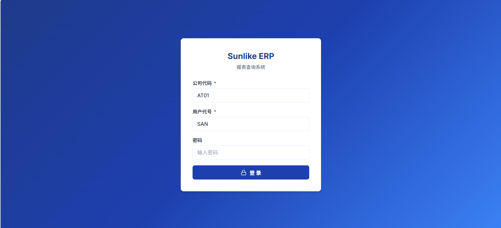

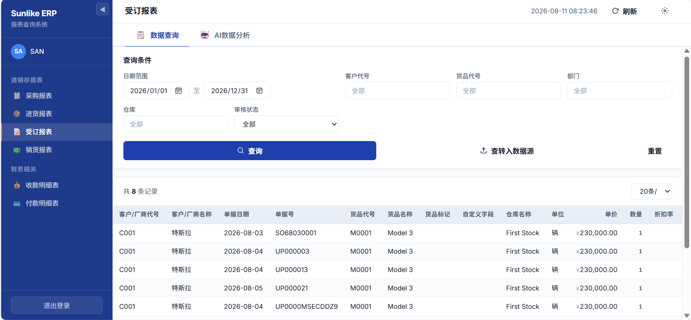

### 数据查询 & AI 分析

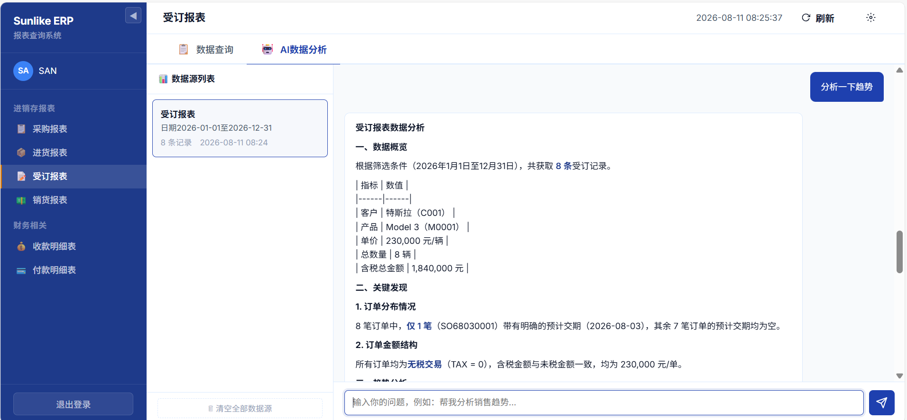

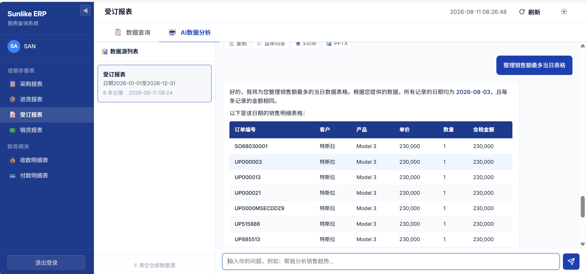

### 更多功能

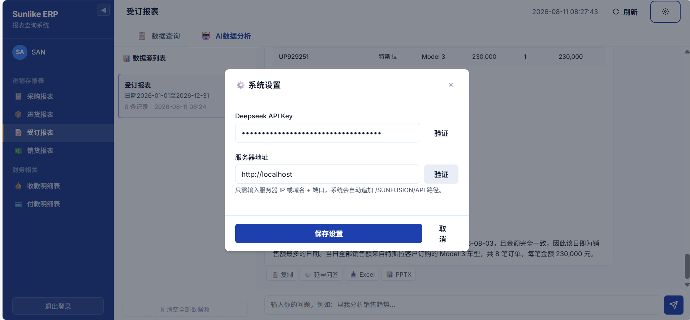

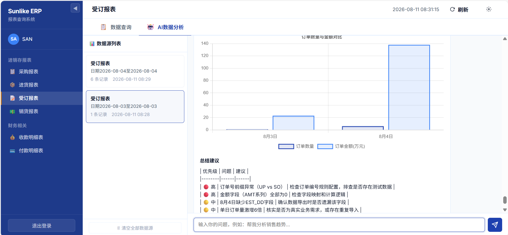

> 💡 运行 `index.html` 即可体验完整功能（需 ERP API 服务器）。

---

## 🏗 系统架构

```
┌─────────────────────────────────────────────────────────┐
│                     Browser (SPA)                        │
│  ┌──────────┐  ┌──────────┐  ┌──────────────────────┐  │
│  │  Login   │  │ 40 报表   │  │   AI 数据分析         │  │
│  │  Auth    │  │  查询     │  │   Chat + Chart + 导出 │  │
│  └────┬─────┘  └────┬─────┘  └──────────┬───────────┘  │
│       │              │                    │              │
│  ┌────┴──────────────┴────────────────────┴──────────┐  │
│  │              25 模块化 JS 引擎                      │  │
│  │  i18n / utils / auth / api / reports / menu /      │  │
│  │  datasource / chat / ai / parser / chart /         │  │
│  │  export / notepad / dialog / app                   │  │
│  └────────────────────────┬───────────────────────────┘  │
└───────────────────────────┼──────────────────────────────┘
                            │
              ┌─────────────┴─────────────┐
              │                           │
    ┌─────────┴─────────┐    ┌───────────┴───────────┐
    │  Sunlike ERP API   │    │   Deepseek API        │
    │  /SUNFUSION/API/   │    │   api.deepseek.com    │
    │  • /user/login     │    │   /v1/chat/completions │
    │  • /invso/getReport│    │   model: deepseek-chat │
    │  • /invpo/getReport│    └───────────────────────┘
    │  • /invpc/getReport│
    │  • /invSa/getReport│
    │  • /monAA/getReport│
    │  • /monBA/getReport│
    │  • /accGeneralLedger│
    │    /GetReportStream│
    └────────────────────┘
```

---

## 📊 业务流程图

> 以下 10 张流程图覆盖系统全链路。点击图片可查看原图，`.drawio` 文件可用 [Draw.io](https://app.diagrams.net/) 打开编辑。

### 01 — 系统整体流程

从登录认证、Token 管理，到 40 大报表查询、AI 数据分析的端到端全链路（含 MRPPU getList 特殊路径 + 9 只长连接 SSE 报表）。

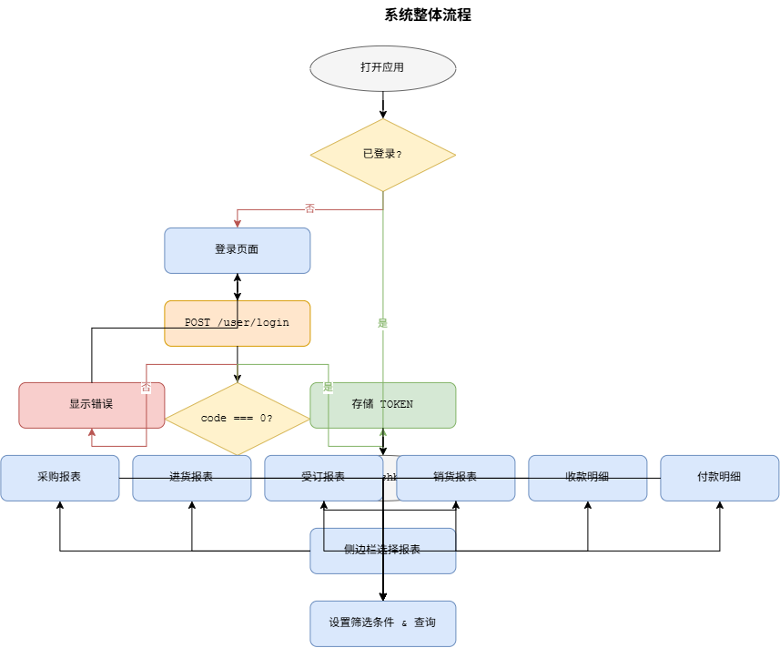

### 02 — 单报表查询流程

标准 getReport 路径（30 报表通用）与 MRPPU getList 特殊路径（产品成本分析表）的分叉查询流程。

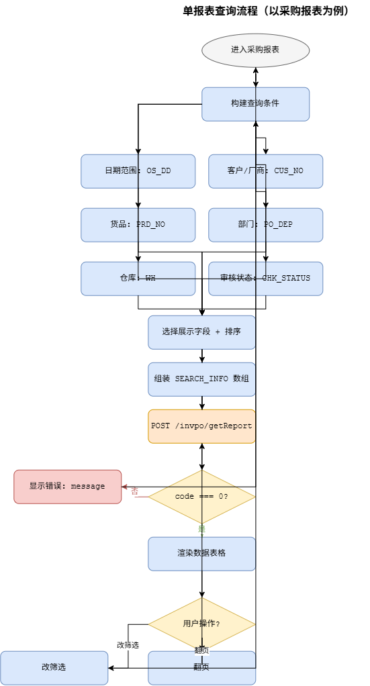

### 03 — API 请求构造流程

SEARCH_INFO 10 元素数组按索引 [0]~[9] 固定顺序组装，displayFields 逗号拼接，最后包装为 `{ PGM, SEARCH_INFO, DISPLAY_FIELDS }`。

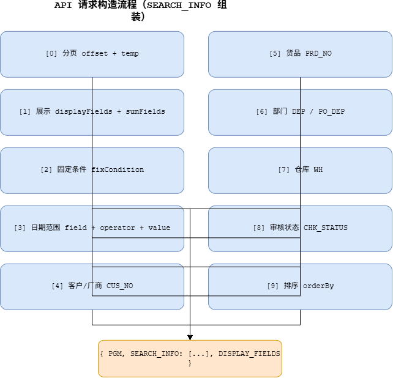

### 04 — 认证流程

登录 → Token 存储（localStorage） → 后续请求自动注入 Authorization Header → 过期拦截（code 20001/20004） → 自动恢复会话。

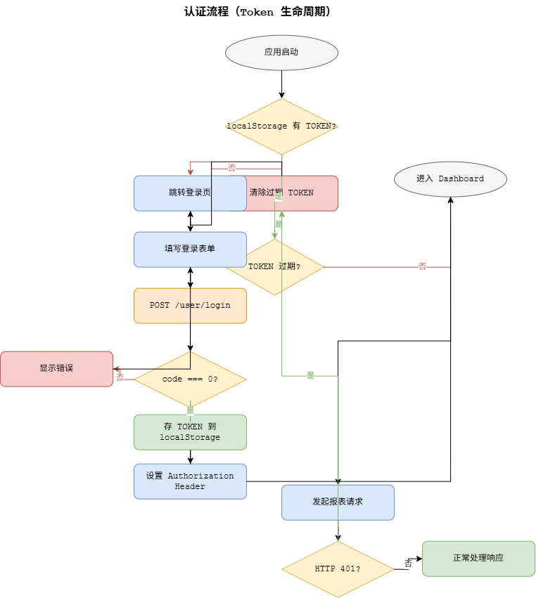

### 05 — API 差异对照

10 个报表的 PGM / 日期字段 / fixCondition / 额外筛选 / 特殊点差异矩阵一览（含 MRPPU getList 架构标注）。
（2026-08-12 更新：新增 21 报表，详见 流程图.md）

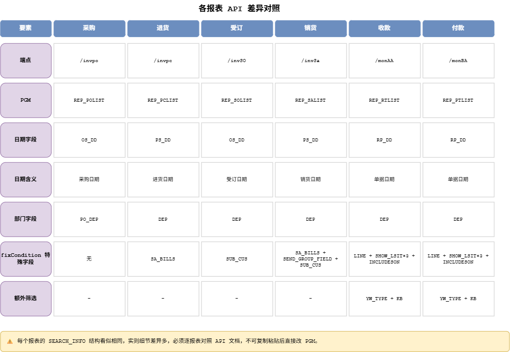

### 06 — UI 页面流

登录页 → Dashboard 主界面 → 侧边栏导航（8 分组 40 报表切换） → 18 布局筛选面板 → Tab 页签 → 多模型 AI。

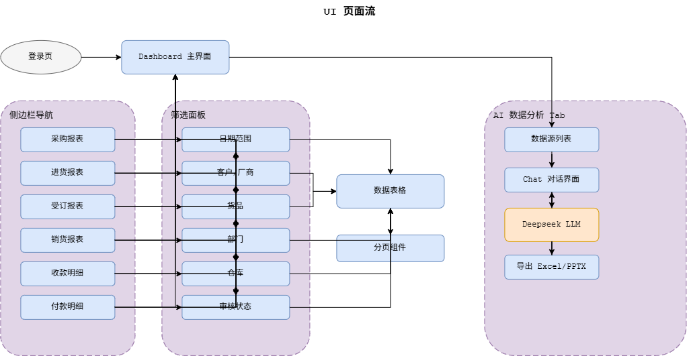

### 07 — AI 数据分析流程

数据转入数据源 → System Prompt 注入 ERP 专家角色 → Deepseek Chat API 调用 → Markdown/表格/图表标记解析 → Chart.js 渲染 + 导出。

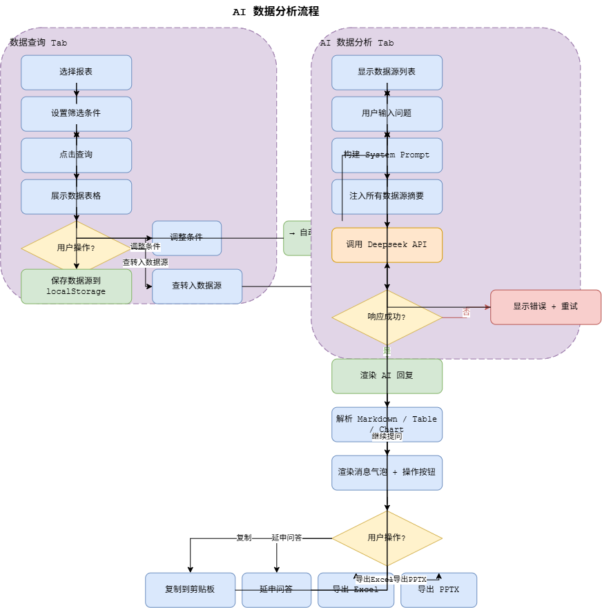

### 08 — Tab 页签切换流程

数据查询 Tab ↔ AI 数据分析 Tab 双向切换，含「查转入数据源」自动跳转和「数据查询」返回。

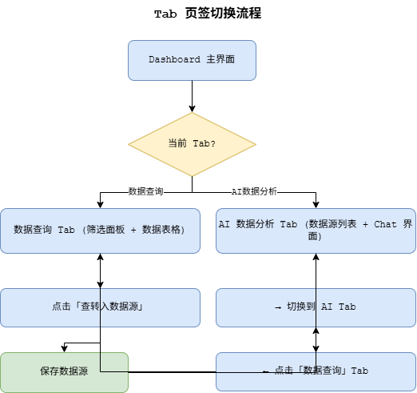

### 09 — 设置面板流程

API Key / 服务器地址配置 → 在线验证（Deepseek API + ERP Server）→ 保存到 localStorage → 立即生效。

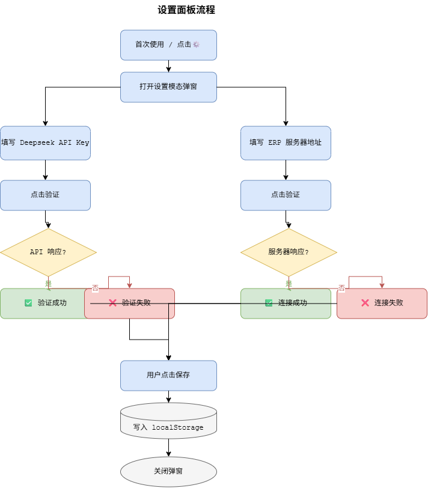

### 10 — 多模型 AI 架构

AIClient 统一客户端 → 4 模型路由（Deepseek / QWen / Gemini / Claude），统一 Key 管理 + 验证 + 向后兼容。

---

## 🚀 快速开始

### 前置条件

- 可访问的 Sunlike ERP API 服务器
- Deepseek API Key（可选，仅 AI 分析功能需要）
- 现代浏览器（Chrome / Edge / Firefox）

### 运行

```bash
# 方式一：直接打开
# 双击 index.html 或通过 HTTP Server 访问

# 方式二：本地服务器（推荐）
npx serve .
# 或
python -m http.server 8080
```

### 首次配置

1. 打开应用 → 登录页选择语言（简/繁/英，默认按操作系统预判）→ 输入公司代码 + 用户名 + 密码
2. 登录后自动弹出设置面板（或点击右上角 ⚙ 图标）
3. 填写 **服务器地址**（仅需 IP:端口，系统自动追加 `/SUNFUSION/API`）
4. （可选）填写 **Deepseek API Key** 并点击验证
5. 保存设置 → 完成！

---

## 📁 项目结构

```
AsCoding/
├── index.html                  ← 生产入口（完整 Dashboard + 40 报表 + AI 分析）
├── ui-template.html            ← UI 原型模板（与 index.html 同步）
│
├── css/
│   ├── auth.css                ← 登录页样式 + 语言选择器
│   ├── dashboard.css           ← Dashboard 布局、侧边栏、表格、分页、Toast
│   ├── ai-analysis.css         ← AI Chat、数据源面板、设置弹窗、表格增强
│   └── notepad.css             ← 记事本页签样式
│
├── js/（25 个，index.html 加载清单）
│   ├── i18n.js                 ← 多语言核心（gettext 风格 t() / applyStatic / 语言解析链）
│   ├── i18n-data.js            ← 三语静态字典（zh-tw / en，简体原文即 key，末尾同步 boot）
│   ├── utils.js                ← 通用工具（Toast / 转义 / 格式化 / deepClone）
│   ├── dialog.js               ← 应用内 confirm/prompt 弹窗
│   ├── settings-store.js       ← 设置持久化（API Key / 服务器地址）
│   ├── datasource-store.js     ← 数据源 CRUD（localStorage，上限 20）
│   ├── book-store.js           ← 账簿清单缓存（AccBook/GetList，登录/会话恢复预热，登出世代计数重置）
│   ├── rpt-style-store.js      ← 报表样式缓存（accRptStyle/getlist，按账簿 BOOK_NO 隔离，TYPE_NO 来自账簿行；财务报表 RPT_NO/TYPE_NO 动态化）
│   │
│   ├── auth.js                 ← 认证模块（登录/登出/Token/会话恢复，LANG_ID 随语言）
│   ├── api.js                  ← API 客户端（fetch 封装/认证注入/错误拦截）
│   ├── reports.js              ← 报表引擎（40 报表配置/SEARCH_INFO 构造/动态表格/28 布局筛选/REM_TYPE 摘要类型 badge/流式请求构造）
│   ├── report-menu-store.js    ← 报表菜单持久化（收藏列表）
│   ├── report-menu.js          ← 动态菜单渲染（搜索/折叠分组/收藏置顶）
│   │
│   ├── datasource-list.js      ← 数据源列表 UI（卡片渲染/筛选摘要）
│   ├── tabs.js                 ← Tab 页签切换（数据查询 ↔ AI 分析 ↔ 记事本）
│   │
│   ├── chat-ui.js              ← Chat 消息气泡/操作按钮/滚动
│   ├── chat-core.js            ← Chat 发送流程编排
│   ├── ai-client.js            ← 多模型 AI 统一客户端（Deepseek/QWen/Gemini/Claude，三语提示词）
│   ├── ai-suggestions.js       ← AI 推荐提问（🧠 大脑按钮）
│   ├── ai-parser.js            ← Markdown/表格/图表标记解析
│   ├── ai-chart.js             ← Chart.js 图表渲染
│   ├── export.js               ← Excel / HTML / PDF / PPTX 导出（标题文件名随语言）
│   │
│   ├── notepad-store.js        ← 记事本 CRUD（localStorage，上限 50，多数据源快照）
│   ├── notepad-ui.js           ← 记事本卡片渲染 + 保存/加载/删除/清空
│   ├── settings-ui.js          ← 设置面板弹窗/验证
│   └── app.js                  ← 主入口（AppState/查询/分页/初始化/表头渲染唯一入口）
│
├── 流程图/                      ← 10 张 Draw.io 业务流程图
├── scripts/
│   └── build_drawio.py         ← 流程图自动生成脚本
│
├── screenshots/                ← 应用截图（界面预览）
│
├── deploy.ps1                  ← 部署包生成脚本（v1.6，31 文件）
├── sunlike-erp-report-v1.6.zip ← 部署包（解压到 Web 服务器目录）
│
└── 文档（项目根目录）
    ├── 需求架构文档.md          ← 项目需求 & 技术架构
    ├── 进度追踪表.md            ← 任务进度 & 风险追踪
    ├── 对话记录.md              ← 每轮对话的完整流水账
    ├── API服务调用说明文档.md    ← Login + 报表 API 实测文档
    ├── 标准报表制表API.md        ← v1 6 个 API 原始文档
    ├── 标准报表制表API2.md       ← v2 4 个 API 原始文档（生产制造 + 人力资源）
    ├── 标准报表制表API3.md       ← v3 21 个 API 原始文档（财务/库存/采购价格/生产/人事/固定资产）
    ├── 标准报表制表API4.md       ← v4 总分类账长连接（GetReportStream SSE）原始文档
    ├── 账簿列表查询.md           ← AccBook/GetList 账簿清单 API 原始文档
    ├── 科目表 列表查询.md         ← AccType/getlist 科目表清单 API 原始文档（仅需 TYPE_NAME 时才查，不在报表样式链路内）
    ├── 报表样式 列表查询.md       ← accRptStyle/getlist 报表样式清单 API 原始文档（财务报表 RPT_NO 来源）
    ├── 标准报表制表API5.md       ← v5 八报表长连接（8 个 GetReportStream：科目余额/资产负债/利润/现金流量/物料分析明细/在制成本明细/在制原料明细/直接原料明细）原始文档
    ├── 流程图.md                ← 16 节业务流程图文字参考
    ├── 部署指南.md              ← Web 服务器部署说明
    └── 项目经验行动指南.md       ← 通用开发纪律速查卡
```

---

## 🔌 API 对接

### 认证

```http
POST http://{host}/SUNFUSION/API/user/login
Content-Type: application/json

{
    "COMPNO": "AT01",
    "USR": "SAN",
    "PWD": "",
    "LANG_ID": "zh-cn",
    "SYS_TYPE": "ERP"
}

# 成功 → { code: 0, data: { TOKEN: "..." } }
# 后续请求 Header → Authorization: Bearer {TOKEN}
```

### 报表查询（通用结构）

```http
POST http://{host}/SUNFUSION/API/{module}/getReport
Authorization: Bearer {TOKEN}

{
    "PGM": "REP_SOLIST",
    "SEARCH_INFO": [
        { "col": "OS_DD", "value": "2026-01-01", "type": ">=" },
        ...9 more items
    ],
    "DISPLAY_FIELDS": "CUS_NO,CUS_NAME,OS_DD,..."
}

# 成功 → { code: 0, data: { REPORT__TAB: [...], COLUMN_INFO: {...} } }
```

### 40 报表速查（8 分组）

| 分组 | 报表数 | 包含报表 |
|------|--------|---------|
| 总账报表 | 5 | 总分类账、科目余额表、资产负债表、利润表、现金流量表（⚠️全部长连接 SSE，账簿必选；财务报表样式 STD001/2/3 需 ERP 侧授权） |
| 进销存 | 4 | 采购、进货、受订、销货 |
| 财务管理 | 8 | 收款、付款、科目预算、信用额度、报销、员工借款、应收票据、应付票据 |
| 库存管理 | 5 | 过期货品预警、安全存量预警、负库存预警、库存调拨、库存调整 |
| 采购与价格 | 5 | 送货单、采购交货状况、委外交货状况、采购政策价格、售价政策价格 |
| 生产制造 | 9 | 工单完成、完工入库、产品成本分析(⚠️getList)、领退补料、单位成本分析、物料分析明细(⚠️SSE)、在制成本明细(⚠️SSE)、在制原料明细(⚠️SSE)、直接原料明细(⚠️SSE) |
| 人力资源 | 3 | 员工年度薪资、人事资料分析、员工明细 |
| 固定资产 | 1 | 财产目录 |

> ⚠️ **关键**：成功判断用 `response.code === 0`，不是 `response.ok`！
> ⚠️ **MRPPU** 使用 `getList` 端点（非 `getReport`），请求体含 OTHERINFO + PAGE_INFO，响应数据在 `data.TRANS`。

### 长连接报表（总分类账 + API5 八报表，共 9 只）

系统长连接（SSE）报表统一模式（2026-08-19 API5 推广后共 9 只）：

- **流式查询**：`POST /{module}/GetReportStream` → `text/event-stream`，每条消息 `data: {CODE, PERCENT, TITLE, ERR, DATA}`；EventSource 不支持 POST，用 fetch + ReadableStream 行缓冲手动解析；三步判别（HTTP 状态 → Content-Type → 流解析）+ AbortController 120s 超时；请求构造由 `cfg.stream` 配置驱动（fixCondition @占位符 + elements + topFields + statGroup）
- **进度条**：PERCENT 实时驱动，白卡片 `position:fixed` 悬浮视口正中央（序列因报表而异、可能回退，UI 只取最新值）
- **账簿下拉**：登录/会话恢复即后台拉取 `AccBook/GetList`（BookStore 缓存 + 登出世代计数重置）；>1 预选第一个；0 账簿弹「未启用总账」警告并禁用查询/转入按钮；BOOK_NO 空值前端拦截（⚠️ API4 总分类账 → HTTP 406；API5 总账 4 只 → HTTP 200 + SSE ERR「账簿不能为空」）
- **报表样式下拉**（财务报表 3 只）：数据链路 `AccBook/GetList 账簿行 TYPE_NO → accRptStyle/getlist 样式清单 → 按 RPT_TYPE 过滤（2=资产负债表/3=利润表/4=现金流量表）→ 预选第一个匹配样式`；查询传所选 RPT_NO + 该样式 TYPE_NO（不能写死——实测写死 "3" 报「报表样式不存在」，动态后出 67 行完整数据）；**账簿一改变样式清单即重取**（缓存按账簿隔离）
- **摘要类型映射**（总分类账/科目余额表）：数据行 `REM_TYPE` —— `1`=期初余额 / `2`=本期合计 / `3`=本年合计；表格彩色徽章展示，转入 AI 数据源时替换为语义文字
- **动态列**（财务报表 3 只）：消息携带 `COLUMN_INFO [{NAME,TITLE}]` 动态生成数值列（年初数/期末数/本期发生数/本年累计数），前导列项目编号+项目名称；行 SPACES 层级缩进 16px/级 + 一级行加粗
- **汇总行**（直接原料明细表）：`_SKIP_STAT='T'` 行表格加粗展示，转入数据源剔除
- **分页**：长连接无 PAGE_COUNT/offset，全量累积 + 客户端切片

---

## 🌐 多语言支持（简 / 繁 / 英）

登录页【简繁英】分段按钮切换，**简体 / 繁体 zh-TW / 英文 en** 三语系，ERP 数据不翻译。

- **切换入口**：仅登录页三个分段按钮（语言自称不翻译）；默认按操作系统预判（zh-TW/zh-HK→繁体，en→英文），用户显式点击才持久化（localStorage `sunlike_lang`），下次沿用
- **机制**：gettext 风格 —— 简体原文即 key，`I18n.t(key)` 本地查静态字典（620+ key × 2 语言），缺失优雅回退简体；`data-i18n` 四属性覆盖静态文字，`i18n:changed` 事件驱动动态内容（表头/表体徽章/分页）即时重刷
- **LANG_ID 跟随**：登录/会话恢复/验证服务器三处请求传 LangTag（`zh-cn`/`zh-tw`/`en`），服务器错误消息天然按语系返回
- **存储与显示分离**：报表名/收藏/记事本等持久化值保留简体规范值，仅渲染点翻译——跨语系切换不损坏已存内容
- **AI 与导出随语言**：系统提示词/推荐问题三语分发（AI 用对应语言作答），导出标题文件名（HTML/PPTX/CSV）随语言

---

## 🤖 AI 数据分析功能

### 支持模型

| Provider | 模型 | 端点 | 说明 |
|----------|------|------|------|
| Deepseek | `deepseek-v4-flash` | api.deepseek.com | thinking: disabled |
| QWen (通义千问) | `qwen-plus` | dashscope.aliyuncs.com | OpenAI 兼容 |
| Gemini (谷歌) | `gemini-3.6-flash` | generativelanguage.googleapis.com | OpenAI 兼容 |
| Claude (Anthropic) | `claude-sonnet-5` | api.anthropic.com | 原生 API + CORS header |

> 通过 AIClient 统一客户端，一个函数调用所有模型。详见 `js/ai-client.js`。

### 工作流程

1. **数据查询** Tab → 筛选条件 → 点击"查转入数据源"（查询结果为 0 笔时拒绝转入并提示「查无数据，所以无法为您进行转入数据源」）
2. 自动切换到 **AI数据分析** Tab
3. 在 Chat 输入框用自然语言提问
4. AI 结合所有数据源进行分析（支持 4 个模型切换）
5. 回复支持 **表格** / **图表** / **Markdown**（含管道表格自动渲染），可导出 Excel / HTML / PDF / PPTX
6. 🧠 **AI 推荐提问**：点击大脑图标，AI 根据当前数据源自动生成深度分析问题

### System Prompt 定制

AI 被训练为 ERP 数据分析专家，会：
- 📋 **强制使用 ```table 格式** 展示一切结构化数据
- 📊 自动选择合适的图表类型
- 🔢 引用具体数字，不凭空编造
- 📝 按"结论→数据→图表→建议"的结构回复
- ⚠️ 严禁输出思考过程/格式自检/推理链条

---

## 🗂 报表菜单（搜索 / 折叠 / 收藏）

40 报表侧边栏为 **REPORT_CONFIG 驱动的动态渲染**：

- **搜索**：中文名模糊 + 拼音首字母匹配，`Ctrl+K` 聚焦（侧边栏折叠时自动展开）、`Esc` 清空
- **分组折叠**：8 分组可折叠（点击标题 / Enter / Space），默认全部折叠（登录/刷新复位）
- **收藏置顶**：条目右侧 ★/☆，收藏后置顶显示在"★ 收藏"区，localStorage 持久化
- **折叠侧边栏（56px）**：全部报表 emoji 平铺，收藏去重置顶

---

## 📓 记事本（多数据源快照）

第三个平行页签【📓 记事本】：将 AI 分析现场一键打包保存为事件，随时恢复。

- **保存**：AI 分析 Tab 底部「📓 存到记事本」→ 输入事件名称 → **全部数据源快照**（含加载中/失败状态）+ 当前 AI 对话 + 保存时选中的数据源，深拷贝存入 localStorage（`sunlike_notepad`，上限 50 个事件）
- **回存**：点击事件卡片 → 确认 → 数据源列表**全量恢复**（保留原始状态）+ 对话历史重新渲染（表格/图表重新解析）+ 自动选中保存时选中的源 + 跳转 AI 分析 Tab
- **兼容**：旧版本保存的单数据源事件回存自动迁移

---

## 🛠 技术栈

| 层 | 技术 | 说明 |
|----|------|------|
| **前端** | Vanilla JS (ES5) | 零框架依赖，IIFE 模块化 |
| **样式** | CSS3 + Design Tokens | Inter 字体，CSS 变量体系 |
| **图表** | Chart.js 4.x | CDN 加载，bar/line/pie/doughnut |
| **AI** | Deepseek/QWen/Gemini/Claude | 4 模型统一客户端，非流式调用 |
| **存储** | localStorage | 认证/设置/数据源持久化 |
| **导出** | CSV + HTML + PDF + PPTX | Excel (CSV UTF-8 BOM) / HTML 报告 / PDF (浏览器打印) / PPTX (PptxGenJS 原生 .pptx) |

### 设计系统

- **配色**：蓝色系主调 (`#1E40AF`) + 琥珀强调 (`#D97706`)
- **字体**：Inter（无衬线正文）+ SF Mono（等宽代码）
- **间距**：8px 基础网格，紧凑 Dashboard 密度
- **响应式**：768px（平板）/ 480px（手机）两个断点
- **A11Y**：`focus-visible`、`prefers-reduced-motion`、`sr-only`

---

## 📋 项目状态

| 阶段 | 状态 |
|------|------|
| 登录 & 认证模块 | ✅ 已完成 |
| 10 大报表查询 | ✅ 已完成 |
| API2 — 4 报表接入 (生产制造+人力资源) | ✅ 已完成 |
| API3 — 21 报表接入 (7 分组全覆盖) | ✅ 已完成 |
| 客户端分页（API offset bug 修复） | ✅ 已完成 |
| 31 报表查询 | ✅ 已完成 |
| CSS/JS 模块化拆分 | ✅ 已完成 |
| 移动端响应式 | ✅ 已完成 |
| Toast 通知重设计 | ✅ 已完成 |
| AI 数据分析 (Phase A+B) | ✅ 已完成 |
| 多模型 AI 支持 | ✅ 已完成 |
| 生产制造报表 (3 个) | ✅ 已完成 |
| 人力资源报表 (1 个) | ✅ 已完成 |
| 财务/库存/价格报表 (14 个) | ✅ 已完成 |
| 固定资产报表 (1 个) | ✅ 已完成 |
| 报表菜单改进（搜索 / 折叠 / 收藏置顶） | ✅ 已完成 |
| API4 — 总分类账（长连接 SSE + 账簿下拉 + REM_TYPE 摘要类型） | 🟡 待浏览器验证 |
| API5 — 8 只长连接报表（总账 4 需账簿 + 生产制造 4，SSE + 动态列 + 汇总行） | 🟡 待浏览器验证 |
| 记事本（多数据源快照） | 🟡 待浏览器 E2E |
| 多语言支持（简 / 繁 / 英） | 🟡 待浏览器三语走查 |
| AI 流式响应 | ⬜ 待开发 |
| IndexedDB 迁移 | ⬜ 待开发 |
| 正式 .pptx 导出 | ✅ 已完成 |

---

## ⚠️ 开发纪律（来自 CLAUDE.md）

```
编码前      → 查文档、做 PoC、列 checklist
模块完成后  → 对照流程图、覆盖所有路径、补齐边界
对话结束时  → 对话记录 ✅ | 计划书 ✅ | 进度表 ✅ | 流程图 ✅

禁止口头禅：
  "应该是…"     → "文档怎么写的？"
  "我觉得…"     → "实测结果是什么？"
  "等一下一起补" → "现在就写"
  "这个简单"     → "这个已经验证过了吗？"
```

---

## 📄 License

Internal project — Sunlike ERP 报表查询系统。

---

🤖 *Built with Claude Code | 2026-08*
