# 流程图

> 项目：Sunlike ERP 报表查询系统
> 创建日期：2026-08-10

---

## 一、系统整体流程

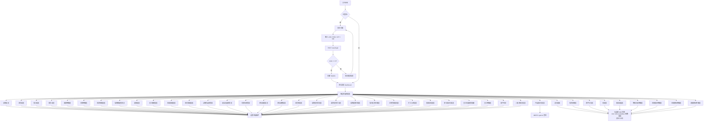

## 二、单报表查询流程（以采购报表为例）

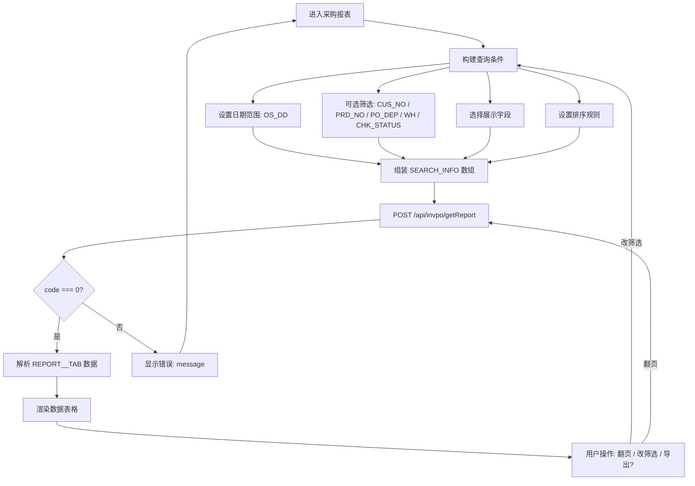

## 三、API 请求构造流程（所有报表通用）

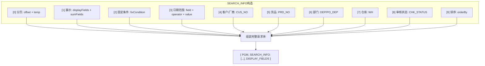

## 四、认证流程（Token 生命周期）

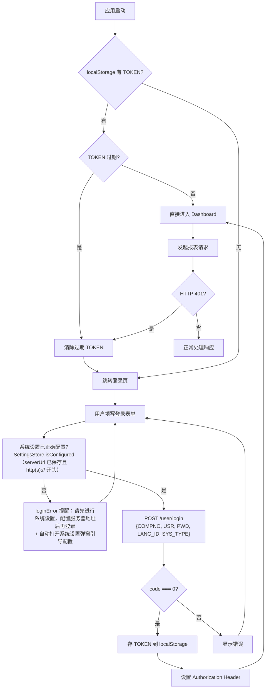

> 说明（Round 57）：登录提交在发请求**之前**先做本地配置检查——别的机器浏览器 localStorage 为空（serverUrl 未保存/格式非法）时不发必然失败的请求，改在 loginError 提示原因并自动打开系统设置弹窗；配置保存后重新点登录即可。检查是纯本地判定（不依赖网络），离线也能完成拦截。

## 五、各报表 API 差异对照

> 以下为 31 个报表的关键差异矩阵。完整配置见 `js/reports.js` 中 `REPORT_CONFIG`。

| 要素 | 采购 | 进货 | 受订 | 销货 | 收款 | 付款 | 科目预算 | 信用额度 | 报销 | 借款 |
|------|------|------|------|------|------|------|---------|---------|------|------|
| 端点 | `/invpo` | `/invpc` | `/invSO` | `/invSa` | `/monAA` | `/monBA` | `/ACCABGT` | `/Rptsarplist` | `/monbx` | `/monjk` |
| PGM | REP_POLIST | REP_PCLIST | REP_SOLIST | REP_SALIST | REP_RTLIST | REP_PTLIST | REP_ACCABGTLIST | RPTSARPLIST | REP_BXLIST | REP_JKLIST |
| 日期字段 | OS_DD | PS_DD | OS_DD | PS_DD | RP_DD | RP_DD | YEARS | - | BX_DD | JK_DD |
| 日期含义 | 采购日期 | 进货日期 | 受订日期 | 销货日期 | 单据日期 | 单据日期 | 年度(equal) | 无日期 | 报销日期 | 借款日期 |

| 要素 | 应收票据 | 应付票据 | 过期货品 | 安全存量 | 负库存 | 调拨 | 调整 | 送货单 | 采购交货 | 委外交货 |
|------|---------|---------|---------|---------|--------|------|------|--------|---------|---------|
| 端点 | `/monCA` | `/monCB` | `/rptinvdo` | `/rptinvdl` | `/rptinvswa` | `/invic` | `/invij` | `/scmdrpti` | `/InvPoPcStatus` | `/InvTwPcStatus` |
| PGM | REP_CALIST | REP_CBLIST | RPT_INVDO | RPT_INVDL | RPT_INVSWA | DRPIC_REP | REP_IJLIST | REPTILIST | INVPOPCSTATUS | INVTWPCSTATUS |
| 日期字段 | RCV_DD | RCV_DD | BASE_DD | - | - | IC_DD | IJ_DD | TI_DD | - | - |
| 日期含义 | 票据日期 | 票据日期 | 基准日期 | 无日期 | 无日期 | 调拨日期 | 调整日期 | 送货日期 | 无日期 | 无日期 |

| 要素 | 采购价格 | 售价价格 | 工单 | 完工入库 | 成本分析 | 领退补料 | 单位成本 | 薪资 | 人事资料 | 员工明细 | 财产目录 |
|------|---------|---------|------|---------|---------|---------|---------|------|---------|---------|---------|
| 端点 | `/invhp` | `/invhs` | `/MrpPK` | `/mrpafc` | `/mrppu` | `/mrpag` | `/mrpcf` | `/rptWagCG3` | `/rptwagyg` | `/rptwagyg` | `/fixaa` |
| PGM | REP_HPLIST | REP_HSLIST | MRPPK | MRPPS | MRPPU | REP_MLLIST | MRPCF | REP_WAGCG3 | REP_WAGYG0 | REP_WAGYG | FIXCE |
| 日期字段 | SYS_DATE | SYS_DATE | MO_DD | MM_DD | DATE_CST | ML_DD | BIL_DD | YEARS | - | SYS_DATE | GR_DD |
| 日期含义 | 系统日期 | 系统日期 | 工单日期 | 入库日期 | 成本年月 | 领料日期 | 单据日期 | 年度(equal) | 无日期 | 系统日期 | 购置日期 |

> ⚠️ 指南第二节提醒：每个报表的 SEARCH_INFO 结构看似相同，实则细节差异多（日期字段名、fixCondition 结构、额外筛选字段），**必须逐报表对照 API 文档**，不可复制粘贴后直接改 PGM。

---

## 六、UI 页面流

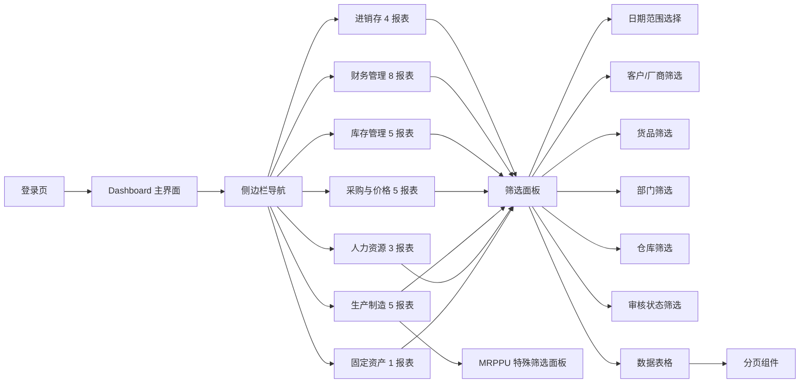

---

## 七、AI 数据分析流程

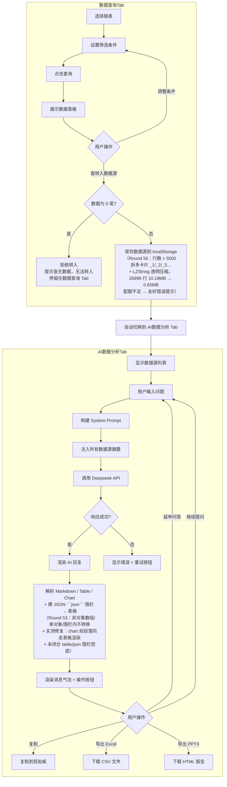

---

## 八、Tab 页签切换流程

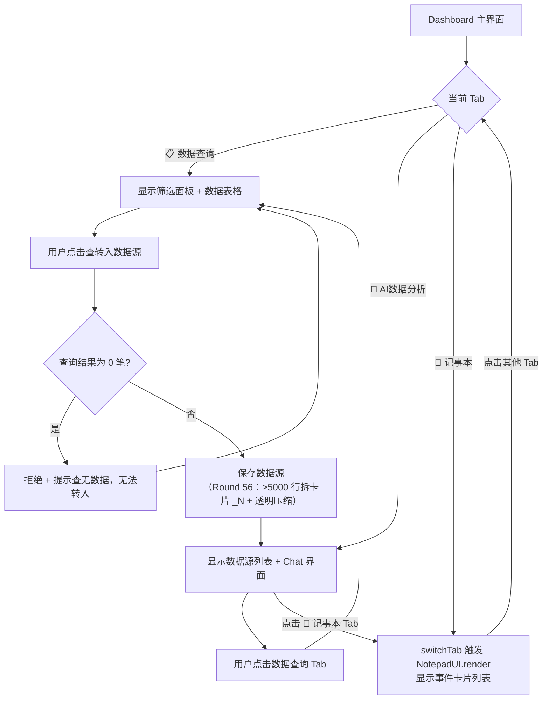

---

## 九、设置面板流程

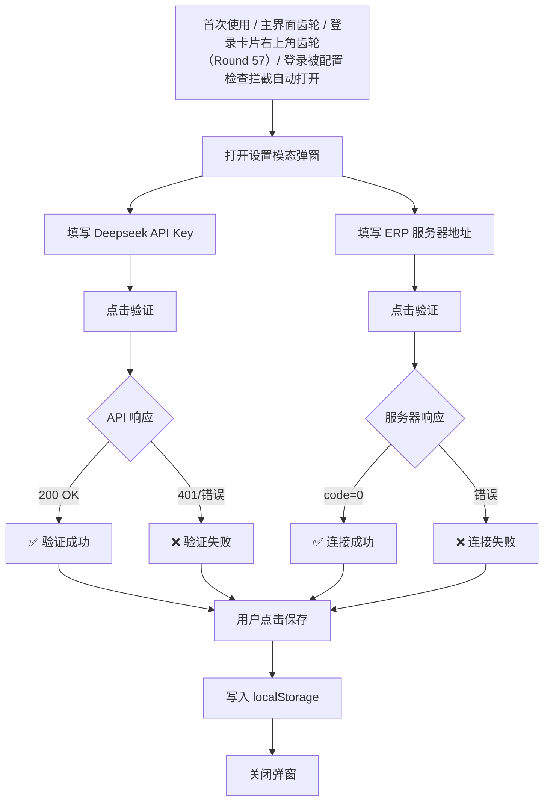

---

## 十、MRPPU 专用 getList 查询流程（成本分析表特殊路径）

```mermaid
flowchart TD
    A[用户选择: 产品成本分析表] --> B[构建 MRPPU 请求体]
    B --> C[OTHERINFO: DEP_GROUP + INCLUDESON]
    B --> D[PAGE_INFO: PAGE_SIZE + CURRENT_PAGE]
    B --> E["SEARCH_INFO[0]: showBody + displayFields<br/>（替代标准分页 offset）"]
    B --> F["4 个固定禁用筛选元素<br/>DEP_GROUP / BIL_ID / DATE_CST / CLOSE_ID"]
    B --> G[SEARCH_INFO[6]: DEP + SEARCH_INFO[7]: PRD_NO]
    B --> H["❌ 无 DISPLAY_FIELDS 顶层字段"]
    B --> I["❌ 无 orderBy 元素"]

    C & D & E & F & G & H & I --> J[POST /mrppu/getList]

    J --> K{code === 0?}
    K -->|是| L["解析 data.TRANS（不是 REPORT__TAB）"]
    K -->|否| M[显示错误: message]

    L --> N["解析 data.COLUMN_INFO 扁平数组<br/>（不是 COLUMN_INFO.REPORT__TAB）"]
    N --> O["解析 data.PAGE_INFO<br/>（TOTAL / TOTAL_PAGES）"]
    O --> P[渲染数据表格]

    M --> A
```

---

## 十一、筛选面板配置驱动系统（17 布局）

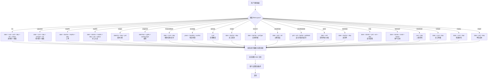

---

## 十二、记事本流程（保存 / 加载 / 删除）

### 12.1 保存事件（全部数据源快照，Round 41 起）

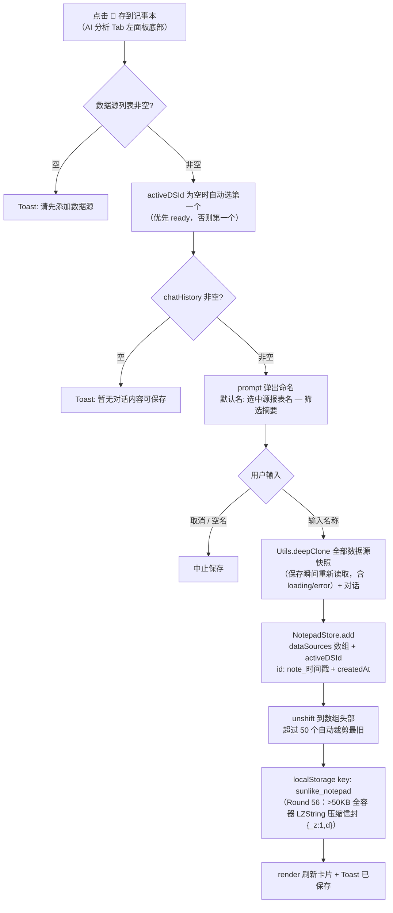

### 12.2 加载事件（一键恢复：全量 + 选中态）

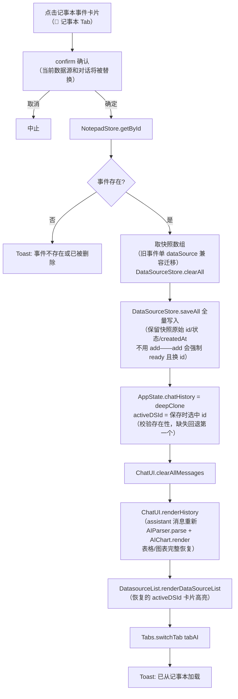

### 12.3 删除与清空

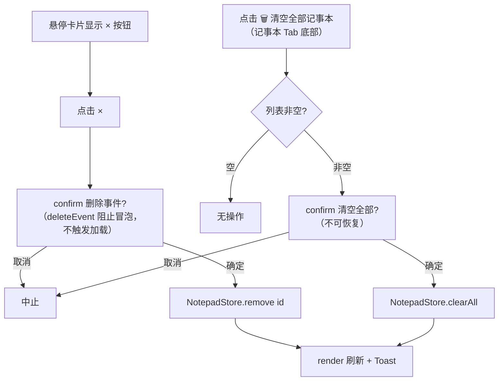

---

## 十三、报表菜单流程（搜索 / 折叠 / 收藏）

### 13.1 渲染主流程

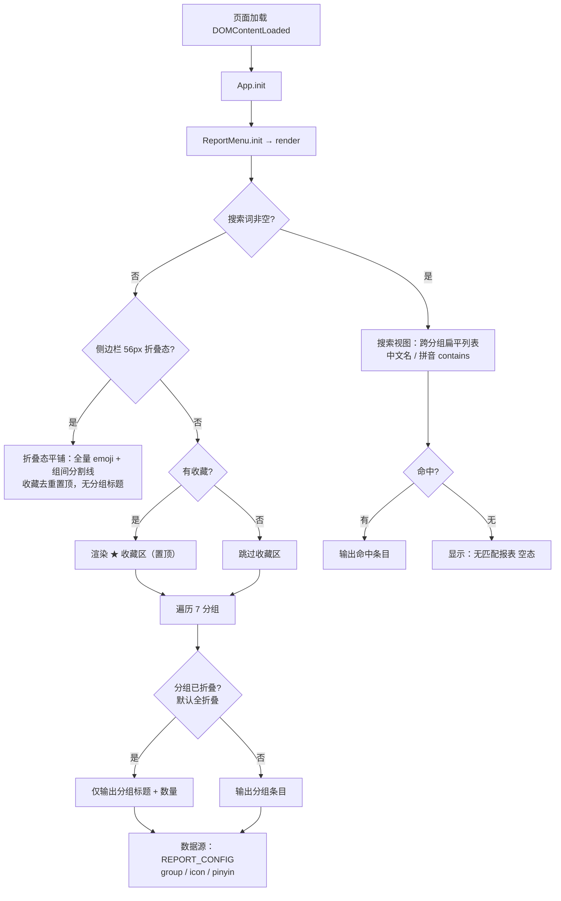

### 13.2 交互流程

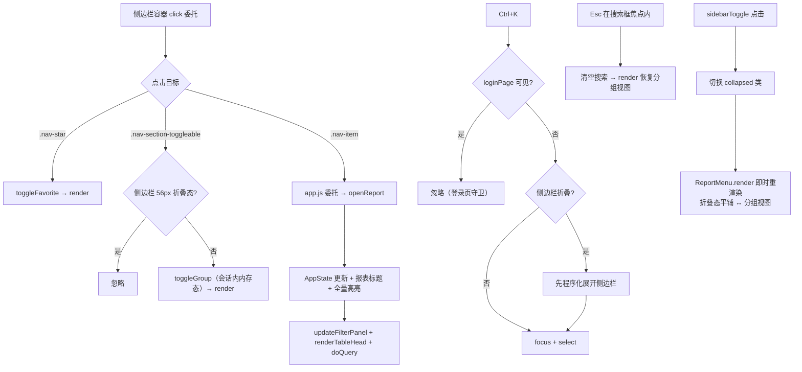

### 13.3 状态持久化

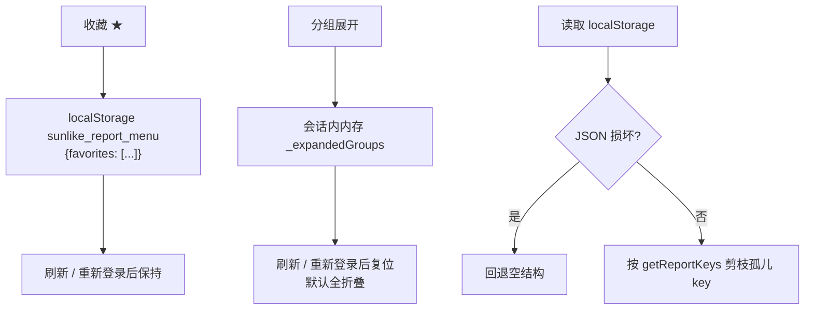

---

## 十四、登录页语言解析链（i18n 启动时序）

### 14.1 I18n.boot() 语言解析（body 末尾脚本同步求值，早于 DOMContentLoaded）

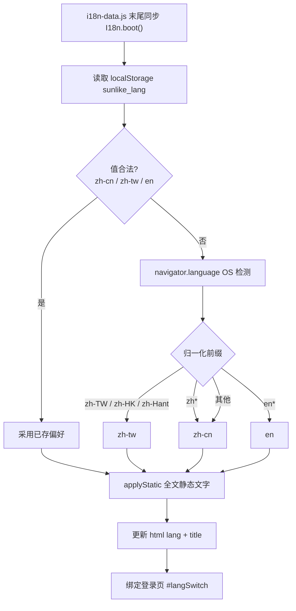

### 14.2 用户切换语言（仅登录页）

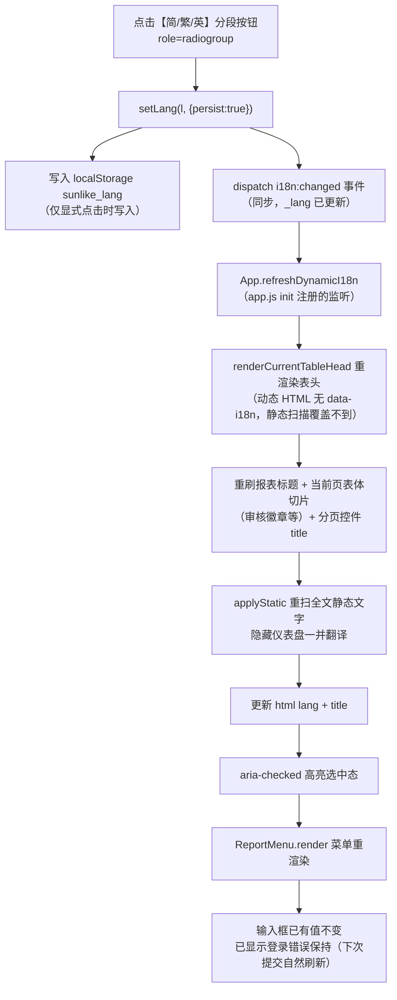

> 说明：Round 40 之前没有 i18n:changed 监听，登录页切语言只覆盖静态文字——表头在 init（登录前）已用 boot 语言渲染固化，登录成功/会话恢复又不重渲染表头，导致"切繁/英登录进来表头仍简体、登出重进才生效"。修复后表头渲染收敛为唯一入口 renderCurrentTableHead（init / 登录成功 / 会话恢复 / openReport 四时机）。

### 14.3 登录请求 LANG_ID 跟随

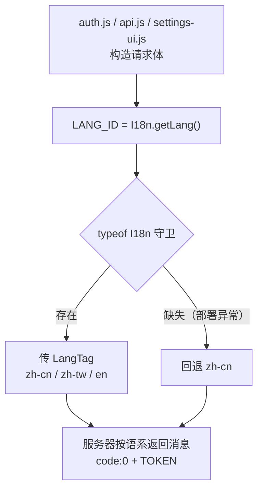

## 十五、长连接（SSE）报表流程（总分类账 + API5 八报表）

### 15.1 打开报表：账簿清单预检（openReport 唯一收口，needsBook 报表专用）

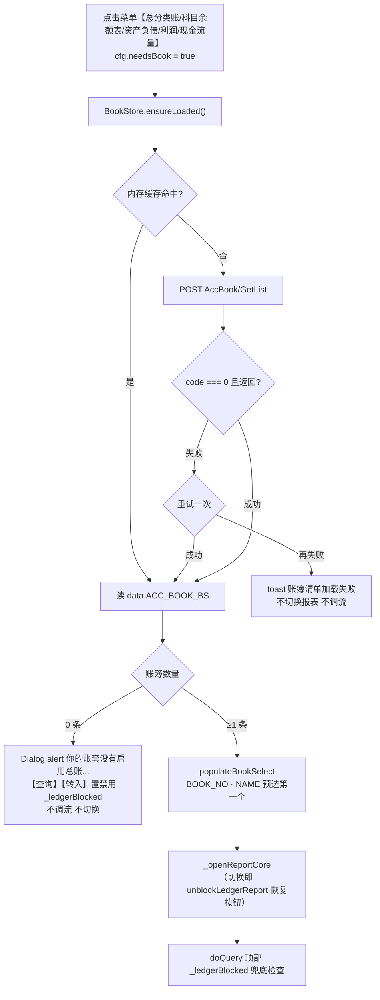

### 15.2 流式查询：三步判别 + 进度条 + 数据累积

```mermaid
flowchart TD
    A["【查询】点击<br/>needsBook 且 BOOK_NO 空 → toast 请选择账簿 拦截<br/>（API4 服务端 406；API5 服务端 200+ERR 账簿不能为空）<br/>MRPCU 且 filterMrpNo 空 → toast 请输入母件代号 拦截<br/>（MO_NO/BOM_NO/MRP_NO 全空 → SQL Server 8623 查询处理器资源耗尽）"] --> B["buildRequestStream<br/>cfg.stream 配置驱动：fixCondition @占位符模板<br/>+ elements 数组 + topFields + statGroup + orderBy"]
    B --> C["resetStreamProgress<br/>fetch POST GetReportStream<br/>AbortController 120s"]
    C --> D{res.ok?}
    D -->|否（406 等）| E[throw HTTP 状态]
    D -->|是| F{Content-Type?}
    F -->|application/json| G["错误信封<br/>Auth.handleAuthError + throw message"]
    F -->|text/event-stream| H["ReadableStream + TextDecoder<br/>行缓冲 buffer.split\\n + lines.pop"]
    H --> I["逐行 parse data: {JSON}<br/>{CODE PERCENT TITLE ERR DATA}"]
    I --> J{msg.ERR 非空?}
    J -->|是| K[throw ERR 文案]
    J -->|否| L["onProgress(PERCENT||0, TITLE)<br/>进度条 fill/文本更新"]
    L --> M{"DATA.REPORT__TAB 数组?"}
    M -->|是| N[rows 累积 + onData]
    M -->|否| O{chunk.done?}
    N --> O
    O -->|否| H
    O -->|是| P["flush 残留缓冲行<br/>返回 rows → 表格渲染 + 分页<br/>finally 隐藏进度条 / clearTimeout"]
    K --> P2["catch：I18n.t(查询失败: {0})<br/>AbortError → 查询超时（120秒）"]
    E --> P2
```

> 说明：PERCENT 是消息 JSON **内的字段**（首消息 0.0 会被 `|| 0` 正确映射为 0，不吞）；100.0 结束消息实测存在；TITLE 混合服务器 i18n key 与中文直文，前端**原样显示不翻译**。BOOK_NO 铁律：空值前端拦截（API4 服务端空 BOOK_NO → HTTP 406；API5 总账 4 只 → HTTP 200 + SSE ERR「账簿不能为空」）。MRPCU 铁律（Round 54 实测 AT04）：母件代号空且工单/BOM/计划号全空 → 服务端 SQL Server 8623；母件代号非空 → 正常出数，故 doQuery 前置拦截（同 BOOK_NO 模式）。

### 15.3 API5 渲染特例：动态列 / 层级 / 汇总行（数据到达后）

```mermaid
flowchart TD
    A["流结束 → 表格渲染<br/>doQuery 先 renderCurrentTableHead 再分页切片"] --> B{cfg.renderColumns?}
    B -->|columnInfo<br/>财务报表 3 只| C["前导列 ITEM_NO 项目编号 + ITEM_NAME 项目名称<br/>+ _currentColumnInfo 映射动态数值列<br/>（年初数/期末数/本期发生数/本年累计数）"]
    B -->|默认| D["displayFields 列 + COLUMN_LABELS<br/>科目余额表 REM_TYPE badge 分支自动生效"]
    C --> E["行渲染：SPACES × 16px 缩进<br/>SPACES=0 → .row-level1 加粗"]
    D --> F["行渲染：_SKIP_STAT==='T'?<br/>（MRPCE showLadder=T 汇总行）"]
    F -->|是| G[.row-total 加粗 + 转入数据源剔除]
    F -->|否| H[普通行]
    E --> I["转入数据源：_SKIP_STAT 统一过滤<br/>筛选摘要含 账簿/会计期间"]
    G --> I
    H --> I
```

> 说明：COLUMN_INFO 可能是数组（财务报表）也可能是 `{}` 空对象（制造报表无数据），前端 Array.isArray 防护；PAGE_COUNT 实测不可靠（有数据为 0/无数据为 1），一律客户端计数分页；PERCENT 序列因报表而异且可能回退（MRPCT 0→1→0→100），UI 只取最新值不假设单调。

### 16.1 三财务报表：报表样式链路（账簿 TYPE_NO → 样式清单 → RPT_NO，Round 52 修正 + 时序修正）

```mermaid
flowchart TD
    A["openReport（资产负债表/利润表/现金流量表）<br/>needsBook → BookStore.ensureLoaded<br/>账簿行自带 TYPE_NO（实测 1）"] --> B["populateBookSelect<br/>option 带 data-type-no = 账簿行 TYPE_NO"]
    B --> C["样式下拉回「加载中...」占位"]
    C --> D["_openReportCore(reportKey, skipAutoQuery=true)<br/>先渲染面板（updateFilterPanel 只切显隐不重建 DOM）<br/>AppState.currentReport 已更新"]
    D --> E["loadRptStylesForBook(reportKey, bookNo)<br/>读选中账簿 option 的 TYPE_NO"]
    E --> F{TYPE_NO 非空?}
    F -->|空| G["toast 账簿无科目表代号<br/>下拉置 无可用样式 不自动查询"]
    F -->|有| H["RptStyleStore.ensureLoaded(bookNo, typeNo)<br/>缓存键 compno+BOOK_NO（账簿隔离）<br/>命中即返；否则 fetchStyles + 失败重试一次"]
    H --> I["fetchStyles(typeNo)<br/>accRptStyle/getlist → data.MF_RPTSTYLE_BS"]
    I --> J{加载成功?}
    J -->|失败| K["toast 报表样式加载失败<br/>下拉置 无可用样式 不自动查询"]
    J -->|成功| L["populateRptStyleSelect(reportKey, bookNo)<br/>按传入 reportKey 的 rptTypeFilter 过滤<br/>（2=资产负债表/3=利润表/4=现金流量表）<br/>❌ 不能读 AppState.currentReport（异步完成时用户可能已切报表）<br/>选项 RPT_NO · NAME 预选第一个"]
    L --> M{该类型有样式?}
    M -->|无| N["下拉占位 无可用样式"]
    M -->|有| O["样式就绪 → doQuery（打开报表时跳过自动查询，这里补上）<br/>校验 filterRptNo 非空<br/>filters.styleTypeNo = 该账簿该样式的 TYPE_NO"]
    O --> P["buildRequestStream<br/>fixCondition / topFields 的 @RPT_NO @TYPE_NO<br/>均走 ph() 替换（顶层 + fixCondition 双层随选择走）"]

    A -.账簿切换.-> Q["filterBookNo change 监听<br/>样式下拉回 加载中... → loadRptStylesForBook(当前报表, 新账簿)<br/>失败回 无可用样式（不自动查询）"]
```

> 说明：TYPE_NO 来自**账簿行**（AccBook/GetList 响应自带，实测 "1"，AccType/getlist 不在链路内——仅需 TYPE_NAME 时才查）；**账簿一旦改变样式清单必须重取**（缓存按 BOOK_NO 隔离）。写死 "3" 实测立即报「报表样式[STD001]不存在或无访问权限」，动态链路后 STD001 + TYPE_NO=1 + BOOK_NO 00000000 出 67 行完整数据。重置按钮：账簿回第一项 → 按账簿重取样式（就绪/失败后再查询）+ 会计期间按 filterLayout（accgl/accglStyle）回当前月；登出 → RptStyleStore.reset 世代作废防旧账套串入。
>
> **转入数据源**：独立全量请求 `ReportEngine.query(reportKey, readFilters(), 1, 5000)` 不经过 doQuery——TYPE_NO 由 readFilters 从样式下拉选中 option 的 `data-type-no` 读出（populateRptStyleSelect 写入），两条路径都拿到；曾因转入路径 TYPE_NO 空导致 ERP 报「科目表代号不能为空」（已修）。
