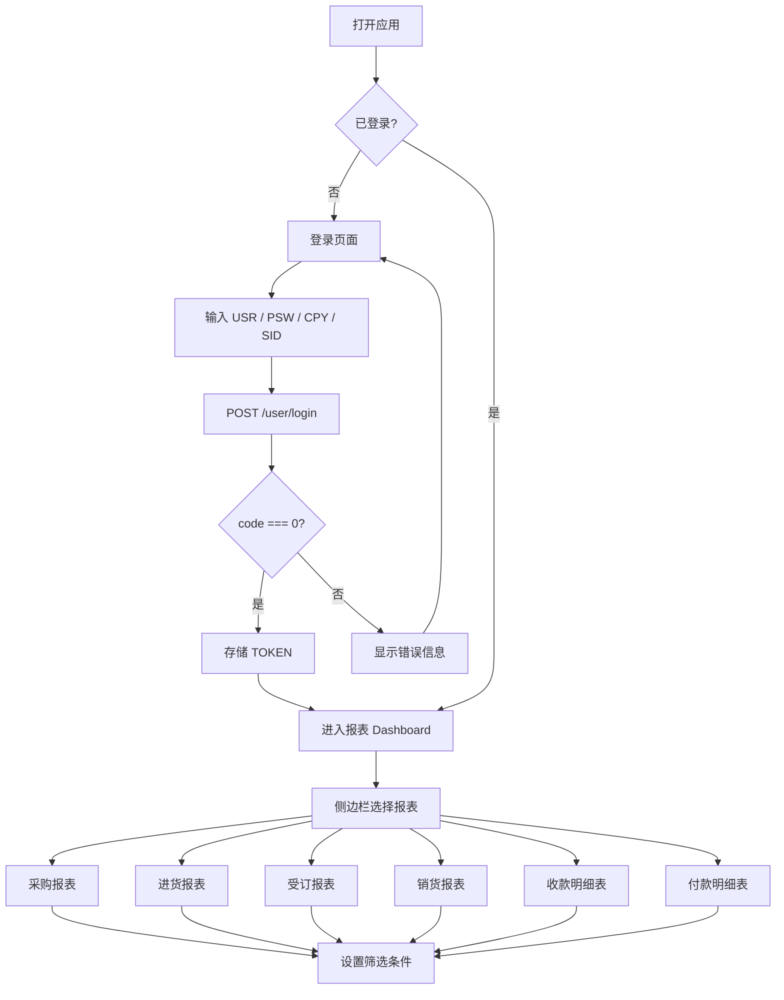
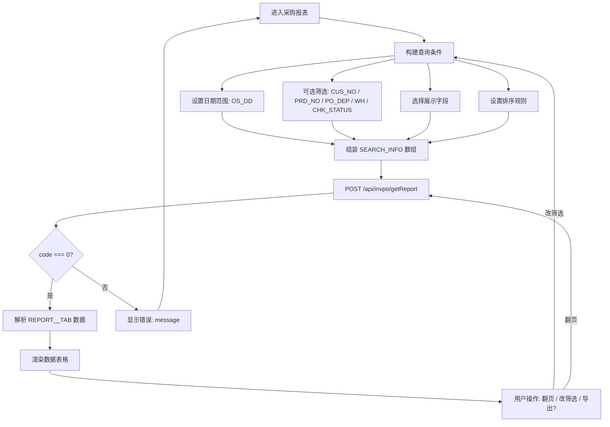
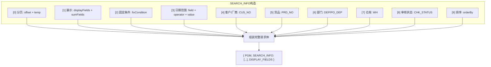
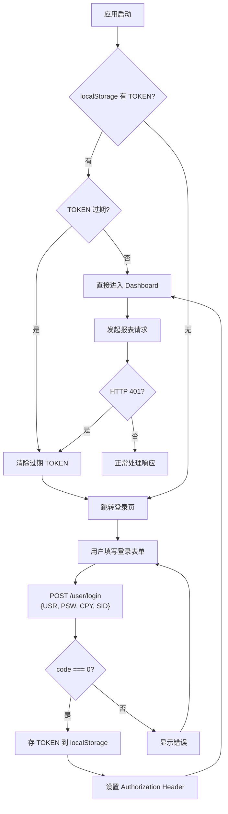
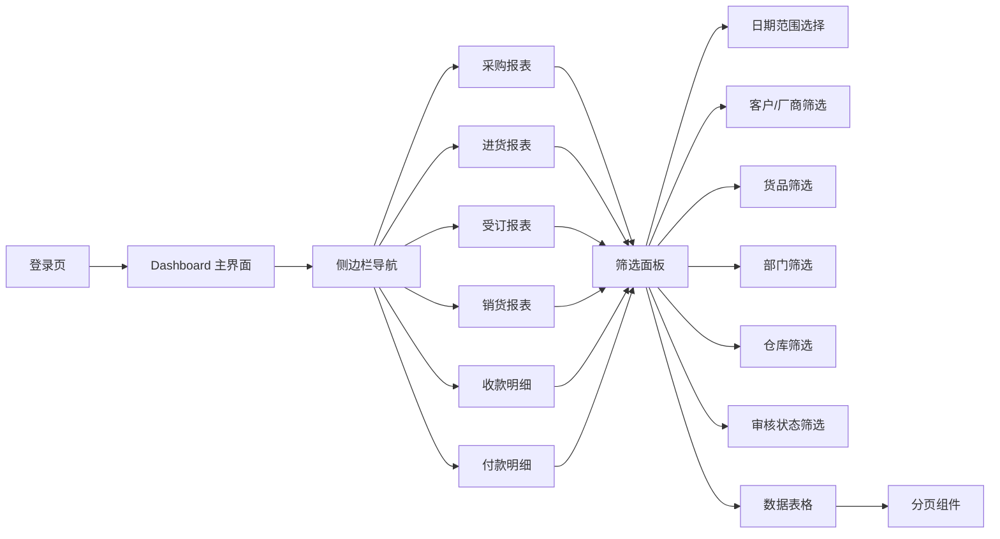
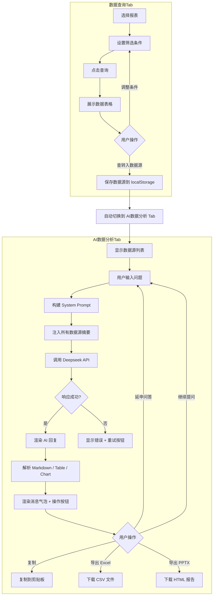
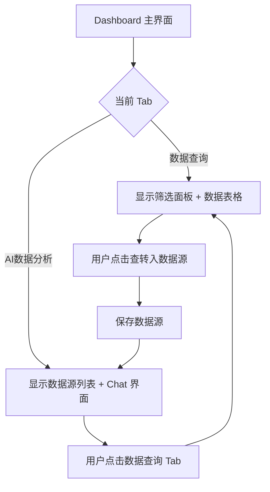
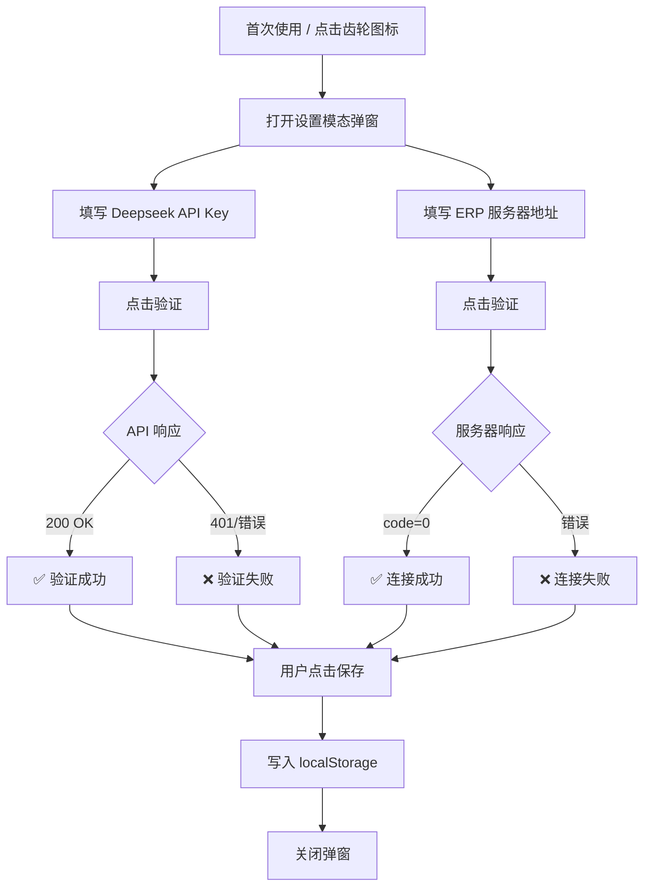

# 流程图

> 项目：Sunlike ERP 报表查询系统
> 创建日期：2026-08-10

---

## 一、系统整体流程

## 二、单报表查询流程（以采购报表为例）

## 三、API 请求构造流程（所有报表通用）

## 四、认证流程（Token 生命周期）

## 五、各报表 API 差异对照

| 要素 | 采购 | 进货 | 受订 | 销货 | 收款 | 付款 |
|------|------|------|------|------|------|------|
| 端点 | `/invpo` | `/invpc` | `/invSO` | `/invSa` | `/monAA` | `/monBA` |
| PGM | `REP_POLIST` | `REP_PCLIST` | `REP_SOLIST` | `REP_SALIST` | `REP_RTLIST` | `REP_PTLIST` |
| 日期字段 | `OS_DD` | `PS_DD` | `OS_DD` | `PS_DD` | `RP_DD` | `RP_DD` |
| 日期含义 | 采购日期 | 进货日期 | 受订日期 | 销货日期 | 单据日期 | 单据日期 |
| fixCondition 特殊字段 | 无 | `SA_BILLS` | `SUB_CUS` | `SA_BILLS` + `SEND_GROUP_FIELD` + `SUB_CUS` | `LINE` + `SHOW_LSIT` x3 + `INCLUDESON` | `LINE` + `SHOW_LSIT` x3 + `INCLUDESON` |
| 部门字段 | `PO_DEP` | `DEP` | `DEP` | `DEP` | `DEP` | `DEP` |
| 额外筛选 | - | - | - | - | `YW_TYPE` + `KB` | `YW_TYPE` + `KB` |

> ⚠️ 指南第二节提醒：每个报表的 SEARCH_INFO 结构看似相同，实则细节差异多（日期字段名、fixCondition 结构、额外筛选字段），**必须逐报表对照 API 文档**，不可复制粘贴后直接改 PGM。

---

## 六、UI 页面流

---

## 七、AI 数据分析流程

---

## 八、Tab 页签切换流程

---

## 九、设置面板流程

